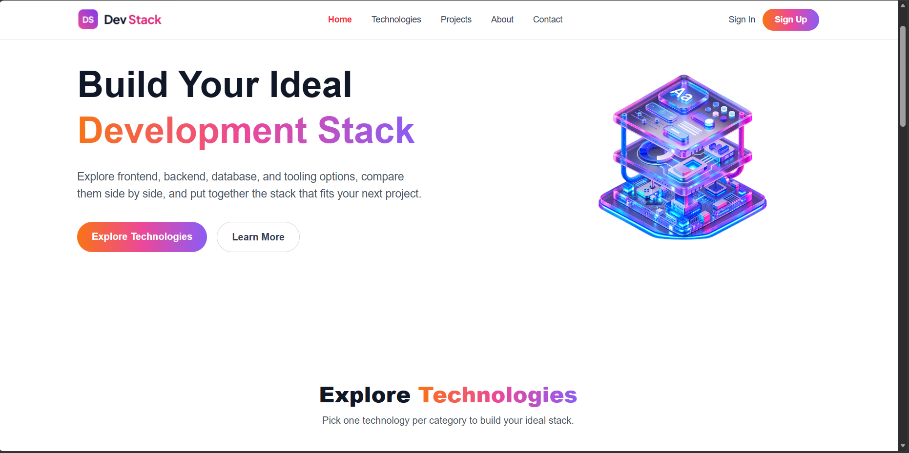

# 🚀 Dev Stack

> A modern, responsive platform for exploring technologies and building your own developer stack.

**[🌐 Live Demo](https://dev-stack-g5-7683.vercel.app/)** · **[📂 GitHub Repository](https://github.com/ahmedZubaer911/dev-stack)**

---

## 📌 About The Project

**Dev Stack** is a responsive web application where developers can explore different technologies and create their own personalized technology stack.

Users can browse available technologies, view their details, add technologies to their stack, and manage their selected technologies easily.

The project was built to practice modern **React development, TypeScript, component-based architecture, state management, and responsive UI design**.

---

## ✨ Features

* 🔍 **Explore Technologies** — Browse technologies with their category, difficulty, rating, and description.
* 🧩 **Build Your Stack** — Add technologies to your personal stack and remove individual technologies or clear the entire stack.
* 📱 **Responsive Design** — Works smoothly across desktop, tablet, and mobile devices.
* 🔔 **Toast Notifications** — Get instant feedback when adding, removing, or clearing technologies.
* ⚡ **Dynamic Data Loading** — Technology information is loaded from a JSON file with a loading state.

---

## 🛠️ Technologies Used

* React
* TypeScript
* Vite
* Tailwind CSS
* React-Toastify
* HTML5
* CSS3
* JSON

---

## 📥 Installation & Setup

### 1. Clone the repository

```bash
git clone https://github.com/ahmedZubaer911/dev-stack.git
```

### 2. Navigate to the project directory

```bash
cd dev-stack
```

### 3. Install dependencies

```bash
npm install
```

### 4. Start the development server

```bash
npm run dev
```

### 5. Open the application

Open the local URL shown in your terminal, usually:

```text
http://localhost:5173
```

---

## 📸 Preview




---

## 📂 Project Structure

```text
src/
├── assets/
├── components/
│   ├── Navbar.tsx
│   ├── Hero.tsx
│   ├── TechnologyList.tsx
│   ├── TechnologyCard.tsx
│   ├── YourStack.tsx
│   └── Footer.tsx
├── types/
│   └── technology.ts
├── App.tsx
└── index.css

public/
└── technologies.json
```

---

## 🎯 What I Practiced

Through this project, I practiced:

* React components
* TypeScript
* Props and state
* `useState`
* `useEffect`
* Conditional rendering
* Rendering lists with `.map()`
* Event handling
* Working with JSON data
* Responsive design with Tailwind CSS
* React-Toastify
* Component communication

---

## ⚛️ React Questions & Answers

### 1. What is JSX, and why is it used in React?

JSX is a syntax that lets us write HTML-like code inside JavaScript/TypeScript. It makes React UI code easier to write.

### 2. What is the difference between props and state?

**Props** are data passed from a parent to a child component. 

**State** is data managed inside a component that can change over time.

### 3. What does the `useState` hook do, and where did you use it in this project?

`useState` is used to store and update data in a React component. In this project, I used it to manage the selected technologies and the loading state.

### 4. What does the `useEffect` hook do, and why did you need it to load the JSON data?

`useEffect` runs code after a component renders. I used it to load the technology data from the JSON file when the application starts.

### 5. Why does every item in a `.map()` list need a unique `key` prop?

A unique `key` helps React identify each item in a list. 

### 6. What is conditional rendering? Show one place you used it.

Conditional rendering means displaying different UI based on a condition.

In this project, I used it in the **Your Stack** section. If there are no selected technologies, it shows an empty-stack message; otherwise, it displays the selected technologies.

### 7. How do you pass data from a parent component to a child component, and how does a child send something back to the parent?

A parent passes data to a child through **props**. A child can send something back by calling a function that the parent passes to it through props.

---

## 👨‍💻 Developer

**Ahmed Zubaer**

GitHub: [ahmedZubaer911](https://github.com/ahmedZubaer911)

---

## 📄 License

This project was created for educational and practice purposes.
